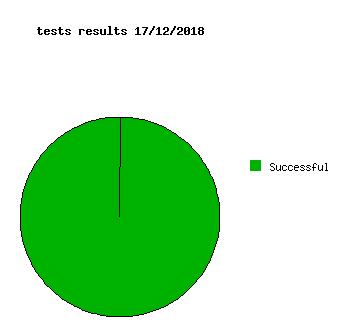

Dashboard
=========

Version
-------
> smk version

```
0.2.0
```

> date -r ./smk --iso-8601=seconds

```
2018-12-17T01:06:15+01:00
```

Test results
------------
```
Successful  25
Failed      0
Empty       0
```


Coverage
--------

```
  lines......: 94.1% (816 of 867 lines)
  functions..: 93.7% (179 of 191 functions)
```

[**Coverage details in the sources**](http://lionel.draghi.free.fr/smk/lcov/home/lionel/Proj/smk/src/index-sort-f.html)

